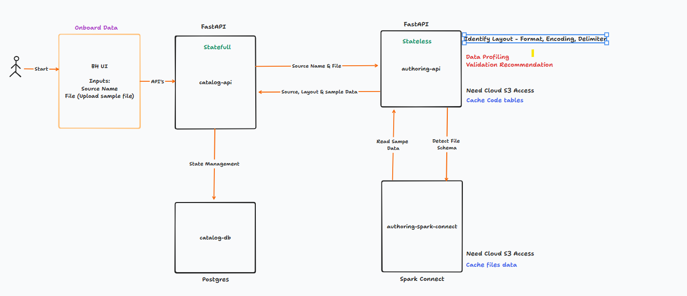

# FastAPI + SQLModel + Alembic

## 1. Virtual Environment Setup (Onetime)

    sudo apt install python-pip -y
    sudo apt install python3-pip -y
    sudo apt install python3-venv -y
    python3 -m venv venv

    ### To Activate Virtual Environment
    source venv/bin/activate

    ### To deactivate virtual environment
    deactivate

## 2. Environment Configuration Variables

### To create a `.env` file, add the following variables:

    POSTGRES_USER=postgres
    POSTGRES_PASSWORD=postgres
    POSTGRES_DB=bighammer_db
    POSTGRES_HOST=catalog-db
    ENVIRONMENT=dev
    AUTHOR_BASE_URL=http://authoring-app:8012
    GITHUB_PROVIDER_BASE_URL=https://api.github.com
    GITLAB_PROVIDER_BASE_URL=''
    AZURE_REPOS_PROVIDER_BASE_URL=''
    BITBUCKET_PROVIDER_BASE_URL=''
    DECRYPTION_KEY=passwordpasswordpasswordpassword
    GOOGLE_CLOUD_PROJECT=nprd-bh-use1-dev
    PROJECT_LOCATION=us-central1
    GOOGLE_APPLICATION_CREDENTIALS=/etc/gcp/credentials.json
    CONNECTOR_PREFIX=bh
    AWS_REGION=us-east-1
    AWS_ACCESS_KEY=*****
    AWS_SECRET_ACCESS_KEY=****
    CLOUD_TYPE=aws
    TOKEN=**************
    OWNER=bh-ai
    REPO=bh-schema
    SAMPLE_DB=sample_db14
    CELERY_BROKER_PASSWORD=password
    BH_APP_BUCKET=bh-utils-dev-client1
    SCHEMA_FILE_PATH=/usr/src/app/schemas/
    BH_AI_AGENT_URL=http://agent-ai-app:8090/api/v1/pipeline_agent/generate
    BH_MONITER_URL=http://monitor-app:8004/api/v1/monitor/
    PIPELINE_ENGINE_VERSION=0.1.0

Include the above variables in the `.env` file and make sure to use your actual `AWS_ACCESS_KEY` and `AWS_SECRET_ACCESS_KEY`.

## 3. To bring up & down docker services

    docker network create shared_network
    docker network ls

    docker compose -f docker-compose.yml up -d --build    # To bring up
    docker compose -f docker-compose.yml down -v          # To bring down

## 4. Alembic Setup for database migrations

    ### Onetime setup
    docker compose exec catalog-app alembic init -t async migrations
    docker compose exec catalog-app alembic revision --autogenerate -m "init"
    docker compose exec catalog-app alembic upgrade head
    docker compose exec catalog-app alembic revision --autogenerate -m "<Replace with Change Message and keep it short without spaces>"

    ### To downgrade database last changes
    docker compose exec catalog-app alembic downgrade -1

## 5. To connect to the cloud service 
    ### Put aws access key and secret access key in docker compose file
# Testing
## Steps to run performance test
    cd project
    cd test
    locust -f perf_test.py

# Lake S3 bucket naming convention

- `lake-name`: Converted to lowercase without spaces
- `env-cd`: Can be one of the following - 'd', 'q', 's', 'p'
- `lake-cd`: Can be one of the following - 'b', 's', 'g', 'q', 'l'
- `random-string`: A string that starts with a character and is followed by 2 numbers (3 characters in total)
- `project-url`: The URL of the project without 'https://www'

For example, if you have a data lake named "MyLake", in a development environment, with a lake code of "b", a random string of "a12", and a project URL of "example.com", the S3 bucket name would be:

s3://mylake.d.b.a12.example.com

### End to End Onbaord flow ###

